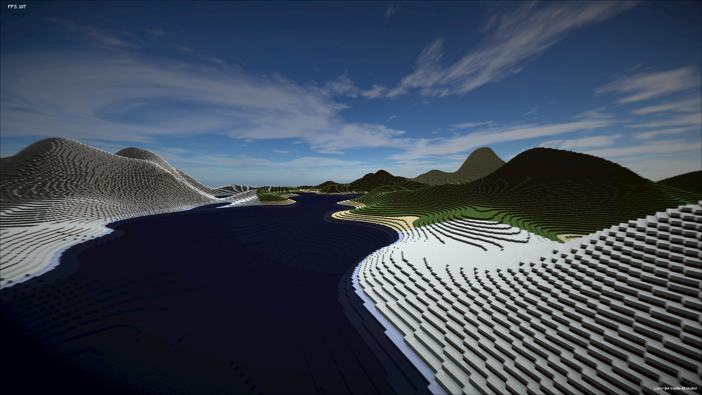
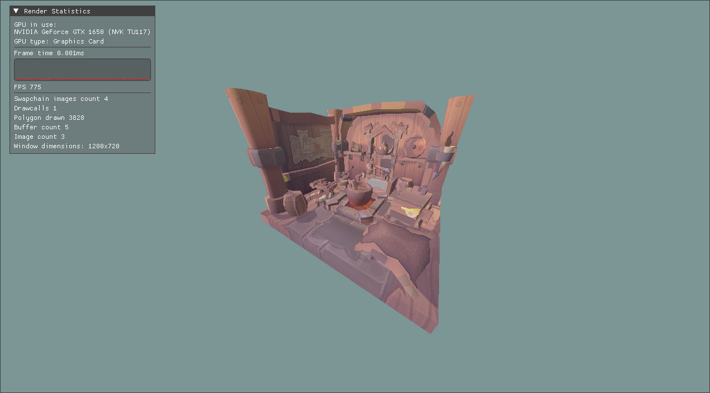
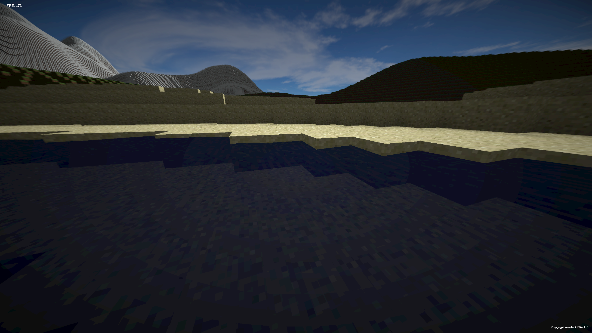

# ScopEngine

A dumb simple monolithic game engine made for School 42's graphics projects written in C++20 with only SDL2 and Vulkan as external dependencies.

### Few screenshots

Here are a few screenshots of projects made with the ScopEngine

